Contact-Information:  This is a Single Page Application which helps users to create new contacts, update them or delete them.

##  Project is hosted at : 
http://ec2-52-24-101-63.us-west-2.compute.amazonaws.com/Contact/
  * UserName: rama
  * Password: rama

## Functionality

1. The newly created contact will be in Active Status
2. User can edit and update the existing contacts using edit and update buttons
3. Phone Number and Email Id's are unique.
4. Contact status can be changed to Active/InActive depending on user's choice.
5. Only InActive Contacts can be deleted.

## TestCases.

1. Add a new contact ( Should be success)
2. Update and existing contact ( Should be success)
3. Try creating a new contact without satisfying the validations.( Should not allow user to create one)
4. Try deleting anInActive contact. (Should be success)
5. Try deleting an Active contact.( Delete option should not be available for an Active Contact)
6. Create a new contact with existing phone number and emaild id( Already Exists alert should be displayed)
7. Update an existing contact with existing phone number and email id.( Already Exists alert should be displayed)
8. Click on Reset button when fields on UI are filled. ( Fields should be cleared).
9. Change Contact status from Active to InActive and vice-versa. (Should be success).

## Source Files

 * [index.html](WebContentindex.html)
 * [controller.js](WebContentangularcontroller.js)
 * [Webservice.java](srccomeasetrackserviceWebservice.java)
 * [WebserviceImpl.java](srccomeasetrackserviceWebserviceImpl.java)
 * [ApplicationDao.Java](srccomeasetrackdaoApplicationDao.java)

## WorkFlow

1. [index.html](WebContentindex.html) contains the main UI layout.

2. When an user fills out the new contact details in UI, the values are loaded into controller which inturn calls the webservices to send the values to [ApplicationDao.Java](srccomeasetrackdaoApplicationDao.java) to perform the execution and save the contact details. CreateInformation validates if the current phone number or email id is unique or not. This module returns the output as "Successfully Created" if the record is unique or output as "Already exists" if the phone number or email id the user entered is not unique.
WebServices->WebservicesImpl->ApplicationDao( Final function is executed and returns the response)
 
3. Inorder to Update the existing details, the user clicks on edit button in the list, which will fill the existing details in the UI form. Now the UpdateInformation function is called which checks if the phone number or the email id's matched with the existing records other than the current ID and update the information if the match case is false. 
WebServices->WebservicesImpl->ApplicationDao(UpdateInformation is executed and returns the response)

4. When the user clicks on delete button of a particular ID, the ID of the selected contacts is passed as parameter to execute the function DeleteInformation and the Id is deleted.

5. When the user clicks on Activate of a particular contact,the ID of the particular contact is passed to call the function updateStatus where the status of the ID changes to Active. 
WebServices->WebservicesImpl->ApplicationDao(updateStatus is executed and returns the response. The parameter passed is the ID of the selected contact).

6. When the user clicks on InActivate of a particular contact,the ID of the particular contact is passed to call the function updateInformationStatus where the status of the ID changes to InActive. 
WebServices->WebservicesImpl->ApplicationDao(updateInformationStatus is executed and returns the response. The parameter passed is the ID of the selected contact).

5. Listing Users has 3 functions

 * Listing both Active and Inactive contacts  When List button is clicked, GetInformationdetails is called which returns all the contacts list in the database.( GetInformationDetails is executed in Application Dao and response is returned in form of list).
 * Listing Active Contacts When Active List button is clicked, GetActiveInformationdetails is called which checks the status of the contacts if they are active and only return those.( GetActiveInformationDetails is executed in Application Dao and response is returned in form of list).
 * Listing InActive Contacts When InActive List button is clicked, GetInActiveInformationdetails is called which checks the status of contacts and return only those who are InActive. ( GetInActiveInformationDetails is executed in Application Dao and response is returned in form of list).

6. When Clicked on Reset, all the values are set to empty so that user can re-enter the details to enter new values in the fields or cancel the operation.

## ScreenShots

1. Home Page
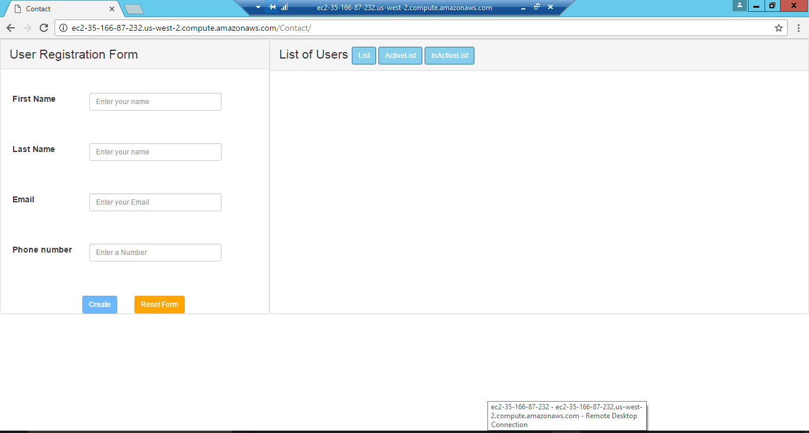

2.  Create Alert
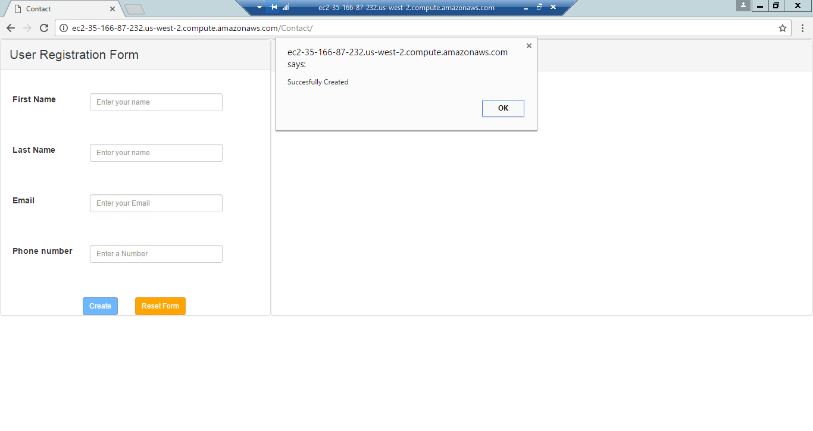

3. List
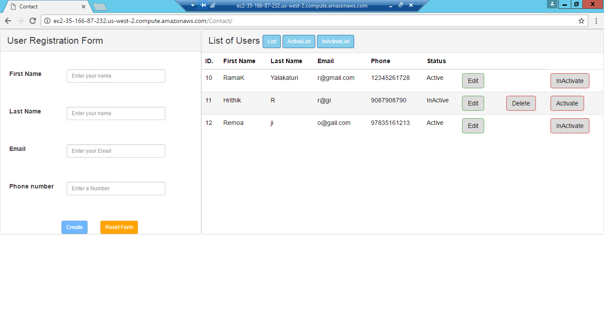

4. Active List
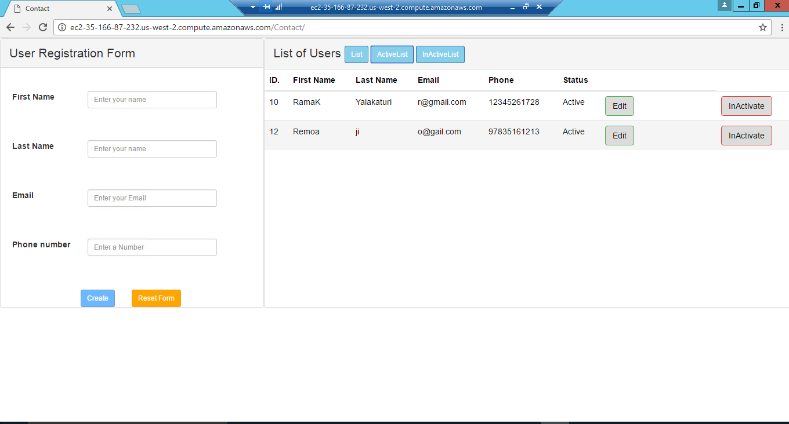

5. InActive List
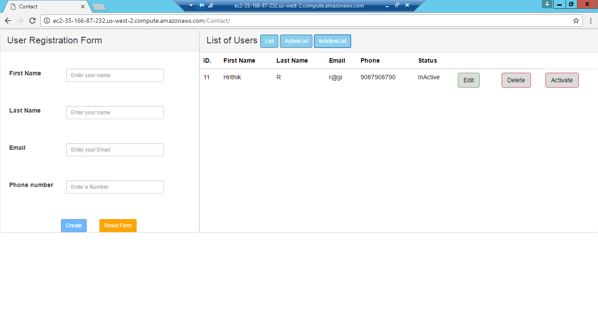

6.  Delete Alert
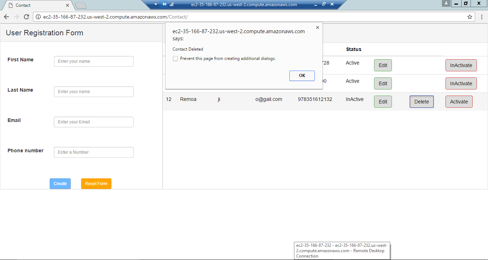

7. Edit Contact
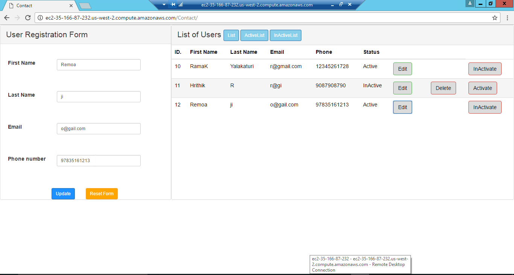

8. Update Contact
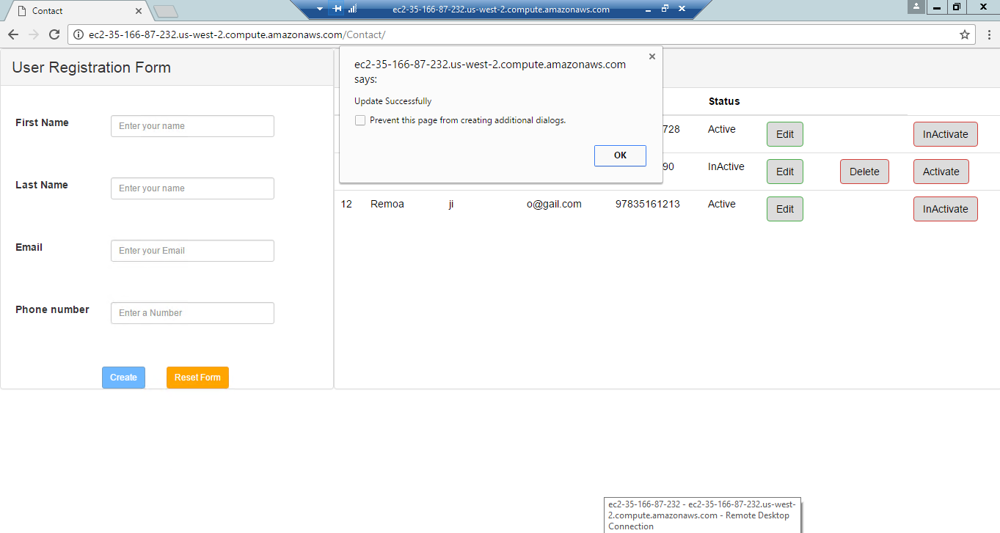

9. Activate Contact
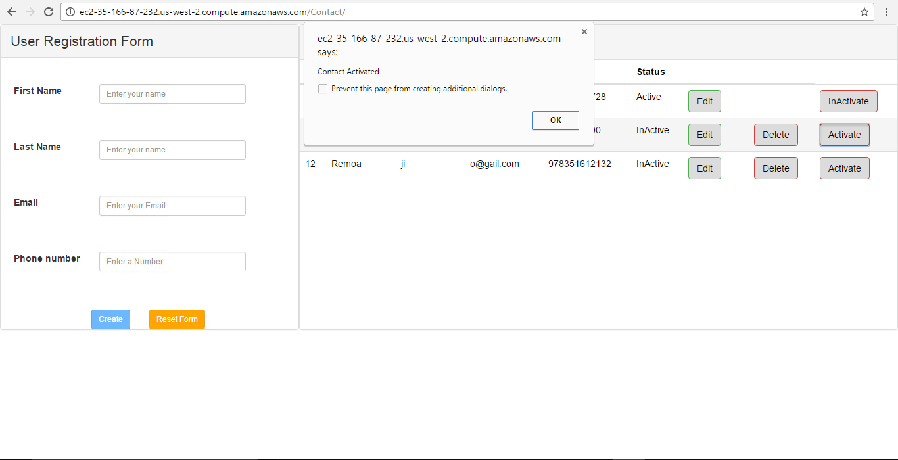

10. InActivate Contact
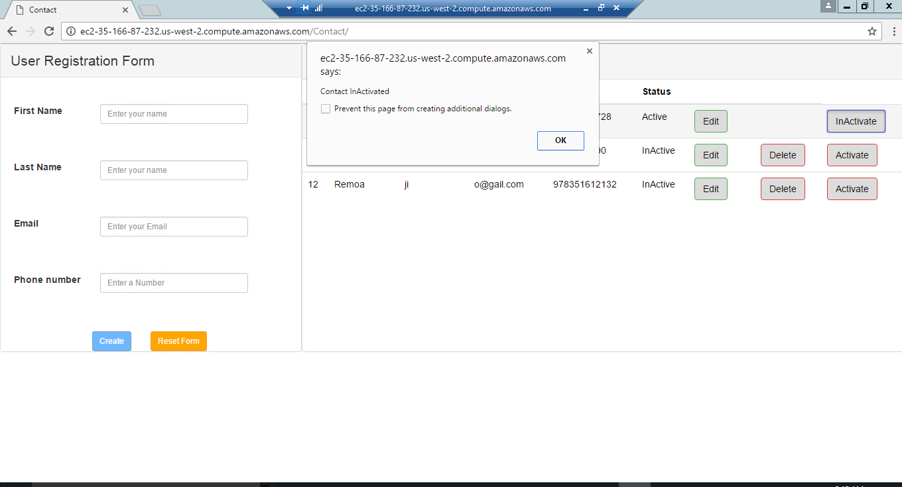

11. Already Exits
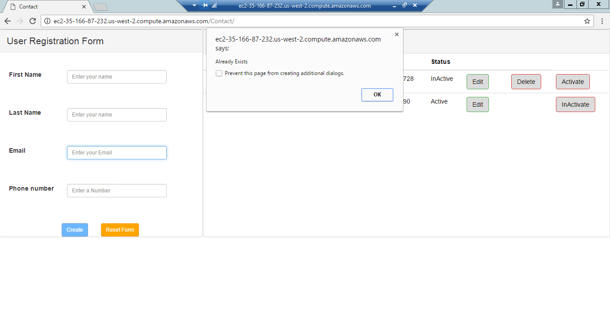

12. Validations
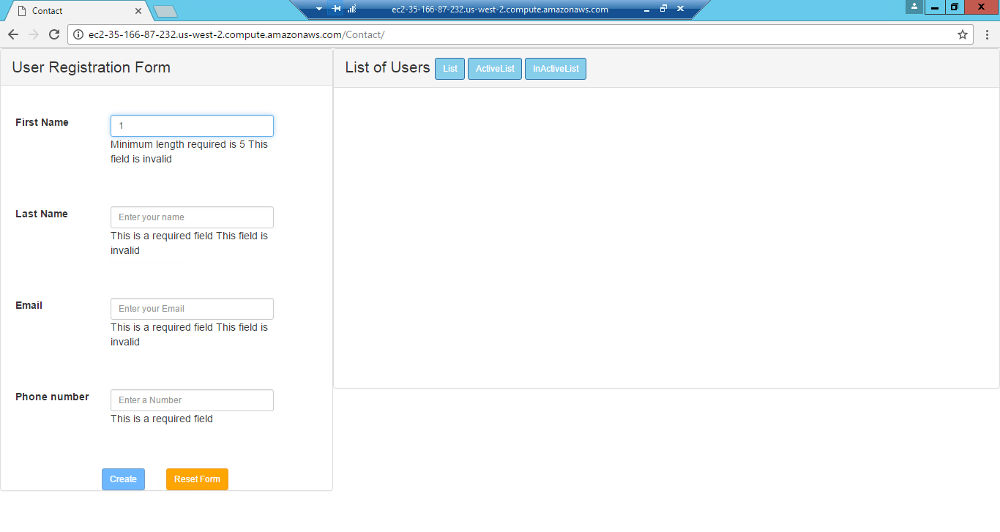
